# Datenintegration für noah.nrw
Harvesting von OAI-PMH-Schnittstellen und Transformation in METS/MODS für das Portal [noah.nrw](https://noah.nrw/)

> **:warning: Dies ist ein Prototyp für die Beta-Version des Portals noah.nrw; für den Produktivbetrieb ist der Einsatz von [metafacture](https://github.com/metafacture) geplant.**

## Datenfluss



## Verwendete Tools

* Harvesting (mit Cache): [metha](https://github.com/miku/metha/)
* Transformation: [OpenRefine](https://github.com/OpenRefine/OpenRefine) und [openrefine-client](https://github.com/opencultureconsulting/openrefine-client)
* Task Runner: [Task](https://github.com/go-task/task)

## Systemvoraussetzungen

* GNU/Linux (getestet mit Fedora 32)
* JAVA 8+

## Installation

1. Git Repository klonen

    ```sh
    git clone https://github.com/opencultureconsulting/noah.git
    cd noah
    ```

2. [OpenRefine 3.4.1](https://github.com/OpenRefine/OpenRefine/releases/tag/3.4.1) (benötigt JAVA 8+)

    ```sh
    # in Unterverzeichnis openrefine installieren
    wget -O openrefine.tar.gz https://github.com/OpenRefine/OpenRefine/releases/download/3.4.1/openrefine-linux-3.4.1.tar.gz
    mkdir -p openrefine
    tar -xzf openrefine.tar.gz -C openrefine --strip 1 && rm openrefine.tar.gz
    # automatisches Starten des Browsers abschalten
    sed -i '$ a JAVA_OPTIONS=-Drefine.headless=true' "openrefine/refine.ini"
    # Zeitraum für automatisches Speichern von 5 Minuten auf 25 Stunden erhöhen
    sed -i 's/#REFINE_AUTOSAVE_PERIOD=60/REFINE_AUTOSAVE_PERIOD=1440/' "openrefine/refine.ini"
    ```
    
3. [openrefine-client 0.3.10](https://github.com/opencultureconsulting/openrefine-client/releases/tag/v0.3.10)

    ```sh
    # in Unterverzeichnis openrefine installieren
    mkdir -p openrefine
    wget -O openrefine/openrefine-client https://github.com/opencultureconsulting/openrefine-client/releases/download/v0.3.10/openrefine-client_0-3-10_linux
    chmod +x openrefine/openrefine-client
    ```
    
4. [metha 0.2.20](https://github.com/miku/metha/releases/tag/v0.2.20)

	a) RPM-basiert (Fedora, CentOS, SLES, etc.)

    ```sh
    wget https://github.com/miku/metha/releases/download/v0.2.20/metha-0.2.20-0.x86_64.rpm
    sudo dnf install ./metha-0.2.20-0.x86_64.rpm && rm metha-0.2.20-0.x86_64.rpm
    ```
   
b) DEB-basiert (Debian, Ubuntu etc.)
	
 ```sh
    wget https://github.com/miku/metha/releases/download/v0.2.20/metha_0.2.20_amd64.deb
    sudo apt install ./metha_0.2.20_amd64.deb && rm metha_0.2.20_amd64.deb
    ```
   
5. [Task 3.2.2](https://github.com/go-task/task/releases/tag/v3.2.2)

	a) RPM-basiert (Fedora, CentOS, SLES, etc.)

    ```sh
    wget https://github.com/go-task/task/releases/download/v3.2.2/task_linux_amd64.rpm
    sudo dnf install ./task_linux_amd64.rpm && rm task_linux_amd64.rpm
    ```
   
b) DEB-basiert (Debian, Ubuntu etc.)
	
 ```sh
    wget https://github.com/go-task/task/releases/download/v3.2.2/task_linux_amd64.deb
    sudo apt install ./task_linux_amd64.deb && rm task_linux_amd64.deb
    ```

## Nutzung

* Alle Datenquellen harvesten und transformieren (parallelisiert)

  ```
  task default
  ```

* Eine Datenquelle harvesten und transformieren

  ```
  task siegen:default
  ```

* Cache einer Datenquelle löschen

  ```
  task siegen:delete
  ```

* Verfügbare Tasks auflisten

  ```
  task --list
  ```

## Konfiguration

* Umgebungsvariablen in [Taskfile.yml](Taskfile.yml)
* Workflow für die Datenquellen in [tasks](tasks)
  * Beispiel: [tasks/siegen.yml](tasks/siegen.yml)
* OpenRefine-Transformationsregeln in [rules](rules)
  * Beispiel: [rules/siegen/hbz.json](rules/siegen/hbz.json)

## OAI-PMH Data Provider

Für die Bereitstellung der transformierten Daten wird der dateibasierte OAI-PMH Data Provider [oai_pmh](https://github.com/opencultureconsulting/oai_pmh) genutzt. Installations- und Nutzungshinweise sind dort zu finden.
